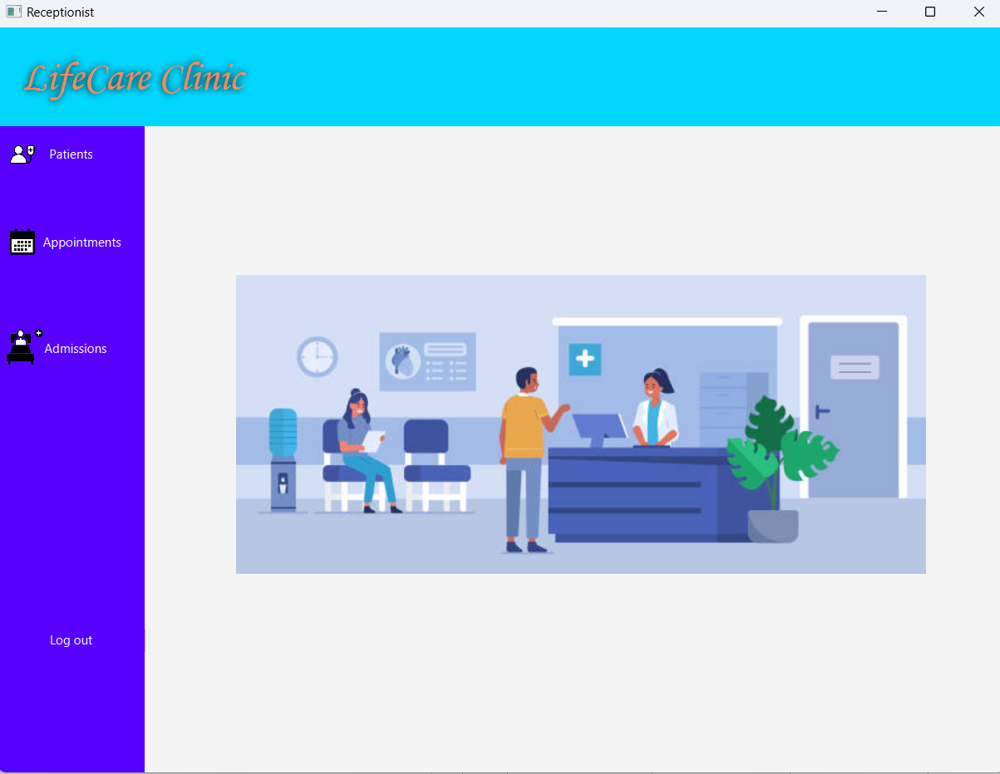

# Hospital Database Management System

## Overview
The Hospital Database Management System is a comprehensive software solution designed to streamline administrative tasks and improve workflow efficiency in hospital environments. It caters to the needs of both receptionists and doctors, providing a user-friendly interface for managing patient records, appointments, admissions, prescriptions, and medical records.

## Features

### User Authentication and Registration
- The system begins with a secure login page, ensuring only authorized personnel can access the application.

*Login page*

*Invalid login message on unauthorized access*

- Users can register accounts via a registration pop-up, providing essential information such as name, username, password, and user type (doctor or receptionist).

*Registration page*

*Checking if data is valid*

- Doctors have the option to specify their specialization during registration.

*Doctors' registration*

### Role-Based Access Control
- Upon successful registration, users are granted access to different functionalities based on their assigned role (doctor or receptionist).

### Receptionist Features

- Receptionists have access to three main options: Patients, Appointments, and Admissions.
- **Patients:** Enables receptionists to add, update, and delete patient information, with data validation to ensure accuracy.

*Patients page*

- **Appointments:** Allows scheduling consultations with specialized doctors, managing patient SSNs, doctor IDs, and appointment details.

*Appointments page*

- **Admissions:** Assists in creating admission documents, calculating medical bills, managing room selection, admission/discharge dates, and associated services.

*Admissions page*

### Doctor Features
- Doctors can add prescriptions and medical records, facilitating diagnosis and treatment management.

- **Medical Records:** Allows doctors to create medical records by selecting appointments and adding diagnoses. They can also prescribe medications and manage multiple records for various diseases.

### Data Management
- The system maintains tables for appointments, patients, medical records, and prescriptions, allowing sorting in ascending or descending order.
- Users can click on table entries to automatically fill corresponding fields.
- Data input validation ensures correctness, and error messages are triggered for incorrect or missing data.

### Additional Functionality
- **Search Functionality:** Users can search for patients by SSN or name, doctors by name or specialization, and services by name.
- **Room Availability:** Receptionists can search for available rooms based on admission and discharge dates, with filters for room type and availability.

### Note on Date Format
- The system requires dates to be entered in 'yyyy-MM-dd' format for accurate data processing.

## Class Diagram

*Class Diagram*
